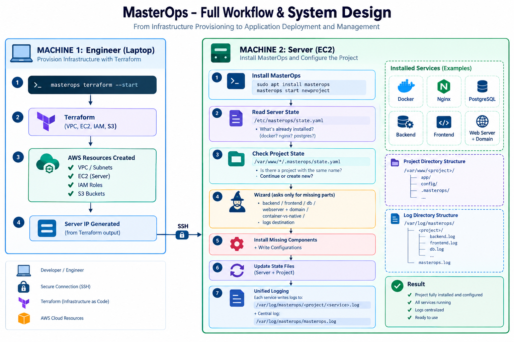
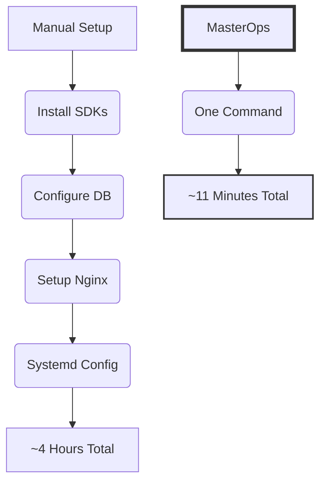
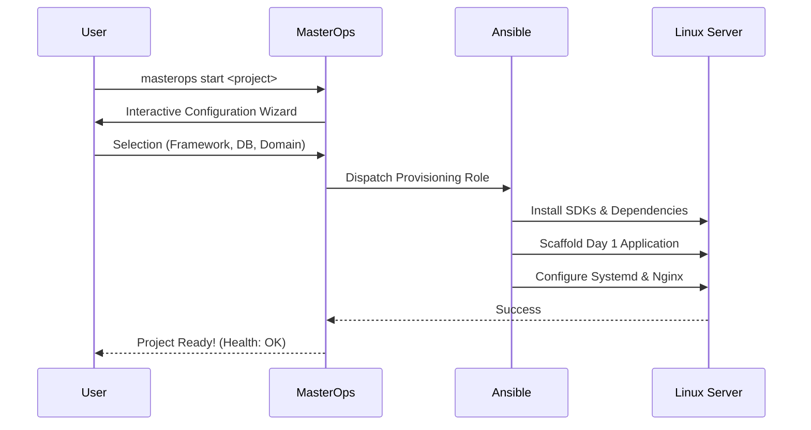

# MasterOps 🚀

<div align="center">
  
  <p><i>The blueprint of production-grade environment automation.</i></p>
</div>

**MasterOps** is a production-grade DevOps bootstrap CLI designed to eliminate the manual toil of setting up application environments on Linux servers. It transforms the "Day 1" experience from a series of manual steps into a single, idempotent command.

---

## 🎯 Why MasterOps?

Setting up a production server typically involves dozens of repetitive tasks. MasterOps automates this entire chain, ensuring that every environment is consistent, secure, and runnable from the very first second.

### 📊 The Efficiency Graph


**Key Benefits:**
- **Zero-Configuration Start**: Go from a blank server to a running app in minutes.
- **Framework Agnostic**: First-class support for .NET, Spring Boot, Laravel, Django, and Go.
- **Infrastructure as Code**: Uses Ansible for idempotent provisioning and Terraform for AWS.
- **Production Ready**: Implements professional systemd management and Nginx vhosts.

---

## 📦 Installation

<div align="center">
  
</div>

### 1. Debian Package (Recommended)
The fastest way to install MasterOps is via the official `.deb` package:
```bash
sudo apt install ./masterops_0.1.15_amd64.deb
```

### 2. Source Installation
For developers wanting to contribute or customize:
```bash
git clone https://github.com/nexus/masterops.git
cd masterops
sudo ln -s $(pwd)/bin/masterops /usr/local/bin/masterops
export MASTEROPS_HOME=$(pwd)
```

---

## 🛠️ Command Reference

| Command | Description | Example |
| :--- | :--- | :--- |
| `start` | **The Day 1 Wizard**. Provisions a full project environment. | `masterops start my-app` |
| `diff` | **Drift Detection**. Detects system inconsistencies. | `masterops diff my-app` |
| `upgrade` | **Config Versioning**. Migrates project state. | `masterops upgrade my-app` |
| `status` | **Health Check**. Inspects project health and services. | `masterops status` |
| `run` | **Service Control**. Manages project services. | `masterops run backend` |
| `cleanup` | **Wipe Project**. Full removal of project state. | `masterops cleanup my-app` |
| `audit` | **Security Audit**. Checks for vulnerabilities. | `masterops audit` |
| `backup` | **S3 Backup**. Encrypted database backups. | `masterops backup` |
| `vault` | **Secret Management**. AES-256 encrypted secrets. | `masterops vault set KEY=VAL` |
| `terraform` | **Cloud Infra**. Automates AWS setup. | `masterops terraform --start` |
| `nginx` | **Web Server**. Global Nginx management. | `masterops nginx --start` |

---

## 🚀 How it Works (Workflow)

### The Provisioning Pipeline


### Deployment Steps
1. **Initiate**: Run `masterops start <project_name>`.
2. **Configure**: Select your tech stack (Backend, Frontend, DB).
3. **Automated Provisioning**: MasterOps handles the runtime, database, and networking.
4. **Verify**: Run `masterops status` to confirm everything is operational.

---

## 🏗️ Architecture

MasterOps is built on a layered architecture for maximum reliability:
- **CLI Layer**: Unified shell interface providing a consistent UX.
- **State Layer**: YAML-based tracking (`.masterops/state.yaml`) for idempotency.
- **Provisioning Layer**: Modular Ansible roles handling OS-level configuration.
- **Security Layer**: Dynamic secret generation via `openssl` to prevent leaks.

## ⏱️ Value Proposition

| Task | Manual Process | MasterOps | Savings |
| :--- | :--- | :--- | :--- |
| OS Hardening | 60 min | 2 min | ~58 min |
| Runtime Setup | 15 min | 1 min | ~14 min |
| Framework Build | 30 min | 2 min | ~28 min |
| Nginx & SSL | 30 min | 1 min | ~29 min |
| CI/CD Pipeline | 120 min | 5 min | ~115 min |
| **Total** | **~4.2 Hours** | **~11 Minutes** | **~4 Hours** |
